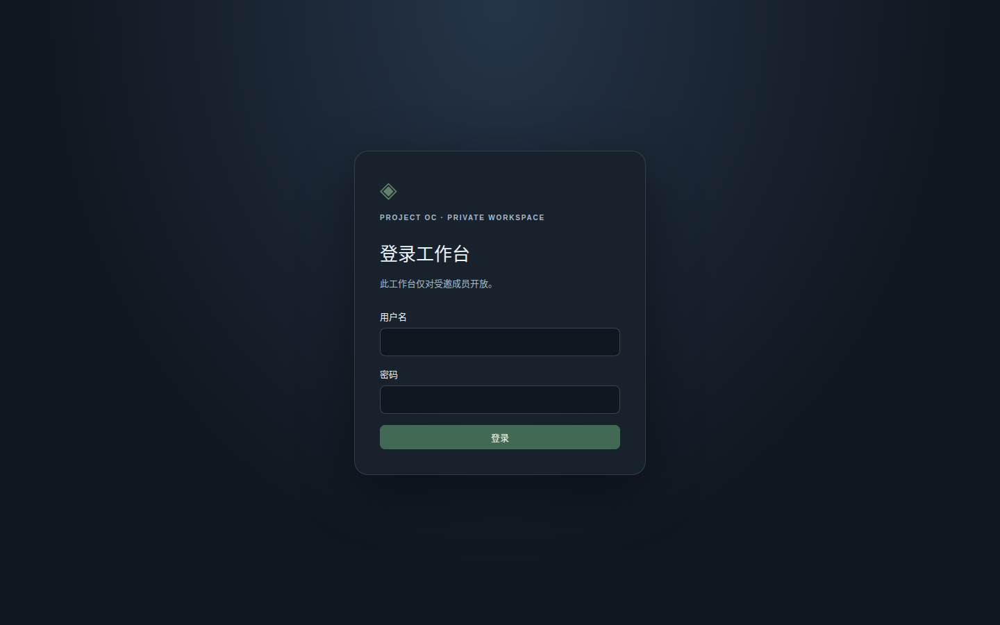
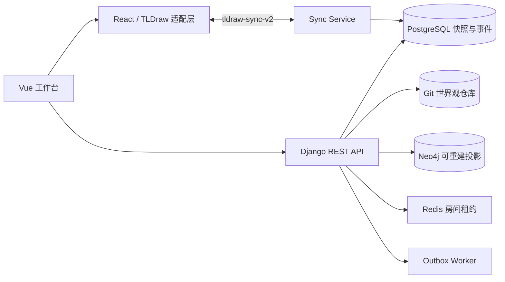

# 未定之书 · ProjectOC

<p align="center">
  <strong>把灵感整理成可审核、可追溯、可协作的世界观。</strong><br>
  面向原创角色与世界观创作者的自托管设定工作台
</p>

<p align="center">
  <a href="https://github.com/HeDaas-Code/ProjectOC/actions"></a>
  <a href="LICENSE"></a>
  <a href="docs/migration.md"></a>
  <a href="https://github.com/HeDaas-Code/ProjectOC"></a>
</p>

<p align="center">
  <a href="#快速开始">快速开始</a> ·
  <a href="#核心体验">核心体验</a> ·
  <a href="#系统架构">系统架构</a> ·
  <a href="#开发与测试">开发与测试</a> ·
  <a href="docs/README.md">完整文档</a>
</p>

> 当前版本适合本地使用和私有网络协作。画布统一使用官方 `tldraw-sync-v2`；历史 `records-v1` 只保留一次性迁移读取能力，已不再提供实时连接或协议降级。



## ProjectOC 是什么

ProjectOC 把“想到一个设定”到“它成为世界观事实”的过程拆成清晰、可回溯的步骤：

```text
灵感画布 → AI 对话 → 实体 / 关系提案 → 人工审核 → 正式世界观
                                      ├── Git 历史
                                      ├── 世界观图谱
                                      └── 时间体系
```

AI 的输出永远先进入提案区。只有经过明确审核，内容才会写入正式实体或关系；布局、分支和同步状态则由独立的画布层管理。

## 核心体验

### 灵感先行

在无限画布中整理 Markdown、LaTeX、Mermaid、便签和实体草稿。草稿可以反复修改，不会污染正式世界观。

### 提案审核

实体和关系都有明确状态、来源和提交前预览。你可以逐条接受、拒绝或修改提案，也可以在写入正式数据前查看差异。

### TLDraw 世界观图谱

每个 `workspace / branch` 拥有独立图谱画板：

- 正式实体使用稳定 `entity:<uuid>` 节点；
- 正式关系使用稳定 `relation:<uuid>` 绑定箭头；
- 移动节点时关系边自动跟随；
- 支持自动布局、类型筛选、孤立节点和失效节点筛选；
- 支持节点详情、关系详情、路径分析和影响范围分析；
- reader 可以查看，editor 可以提出修改，owner 可以管理画布与分支。

### 分支与历史

在分支中探索设定，审核后再合并回主线。正式数据由 PostgreSQL 保存，Git 记录内容历史，图谱布局由 `tldraw-sync-v2` 保存，Neo4j 作为可重建投影。

## 快速开始

需要 Docker 和支持 `--wait` 的 Docker Compose：

```bash
git clone https://github.com/HeDaas-Code/ProjectOC.git
cd ProjectOC
[ -f .env ] || cp .env.example .env
docker compose up -d --build --wait --wait-timeout 180
```

打开工作台：

- [http://localhost:5173](http://localhost:5173/) · 前端工作台
- [http://localhost:8000/health/](http://localhost:8000/health/) · 后端健康检查
- [http://localhost:8787/health](http://localhost:8787/health) · 画布同步服务状态

常用命令：

```bash
docker compose ps
docker compose logs --tail=100 backend sync-service outbox-worker
docker compose up -d --build --wait --wait-timeout 180
docker compose down                 # 保留数据卷
docker compose down -v              # 删除数据库卷，谨慎使用
```

默认端口只绑定到 `127.0.0.1`。需要远程访问时，请同时配置 HTTPS/WSS、CORS、CSRF、WebSocket origin、独立密钥和备份策略。

## 系统架构



| 模块 | 技术 | 职责 |
| --- | --- | --- |
| `frontend/` | Vue 3、TypeScript、Pinia、Vite | 工作台、提案审核、图谱和时间线 |
| `backend/` | Django、Django REST Framework | 账户、权限、实体关系、分支、提案与任务 |
| `sync-service/` | Node.js、`TLSocketRoom`、`SQLiteSyncStorage` | 官方 TLDraw 协议、房间租约、重连和持久化 |
| `world_repos/` | Git | 世界观内容历史；不提交到应用源码仓库 |
| PostgreSQL / Redis / Neo4j | 数据与基础设施 | 正式数据、租约、可重建图谱投影 |

## 数据安全与一致性

- AI 内容不会绕过审核直接成为正式事实。
- 后端始终执行 owner/editor/reader 权限，前端禁用按钮不是安全边界。
- snapshot 保存使用版本检查，冲突不会静默覆盖更新内容。
- Neo4j 投影失败不会回滚已经提交的 PostgreSQL 数据，outbox worker 会继续重试。
- `records-v1` 仅用于历史迁移读取，实时 WebSocket 请求会被拒绝。
- 生产环境请为数据库、Git 世界观仓库和同步快照制定联合备份与恢复演练。

## 开发与测试

```bash
# 后端
.venv/bin/python backend/manage.py check
.venv/bin/python -m pytest backend/tests -q

# 前端
cd frontend
npm ci
npm run build

# 同步服务
cd sync-service
npm ci
npm test
```

开发分支约定：从 `main` 创建 `codex/<topic>` 或其他功能分支；保持小而可回滚的提交，提交 PR 到 `main`，不要直接向主线推送开发提交。

## 文档

- [文档索引](docs/README.md)
- [开发指南](docs/development.md)
- [架构说明](docs/architecture.md)
- [部署与运维](deploy/README.md)
- [旧协议升级](docs/migration.md)
- [同步服务说明](sync-service/README.md)
- [贡献指南](CONTRIBUTING.md)

## 许可

源码使用 [MIT License](LICENSE)。第三方依赖、模型服务和 TLDraw 生产许可按各自条款使用。
